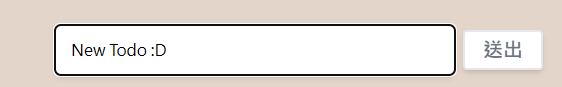

講到功能，我們的了解需求後，基本上第一步都是先釐清整個流程，確認流程沒有問題之後才進行實作。
那麼我們先來看一下新增 todo 的流程。
user 輸入資料 => 點下送出 => 資料出現在畫面上。
以 user 的角度來看當然就是這麼的簡單，但我們畢竟是工程師，在了解 user 的需求之後還是要回到工程師的視角來看待整個問題。
user 輸入資料 => 透過事件捕捉獲得 user 輸出的 data => user 按下送出 => 將剛才獲得的 data 加入到資料儲存的地方。

那麼現在我們已經知道整個流程 & 如何實作，接下來就可以開始製作功能了。

首先看到最前面，當 user 輸入資料的時候，我們透過事件捕捉來獲得資料，這時候我們先回頭看一下前幾天做過的一項功能，在 user 輸入資料的時候透過`onChange`事件來觸發儲存資料的 function。

//TodoInput

```
  const handleChange = (e) => {
    setInputValue(e.target.value);
  };
    <input
    type="text"
    onChange={handleChange}
    />
```

並且按下送出之後我們可以得到這個資料。

```
  const handleSubmit = () => {
    const result = inputValue;
    handleOnSubmit(result);
  };
  <div
  onClick={handleSubmit}
  ></div>
```


接下來我們要做的事情就是把 user 輸入的資料加入我們放資料的位置。
我們昨天透過 api 獲得 todo 的資料，並存在`todoList`這個常數中，那麼我們現在要做的就是把獲得的資料透過`setTodoList`塞進這個 array 裡面。

```
  const handleGetSubmitResult = (result) => {
    console.log("from TodoInput:", result);
  };
```

前面我們透過這個 function 獲得了子元件的資料，現在我們可以知道這個 function 的 result 就是 user 輸入的資料，這邊我們先取個巧，透過抓取 array 中的最後一個 item 來獲得相同格式的資料。

```
  const handleGetSubmitResult = (result) => {
    // console.log("from TodoInput:", result);
    setTodoList(() => {
      const getLastItem = todoList[todoList.length - 1];
      const newTodo = [
        ...todoList,
        { ...getLastItem, id: getLastItem.id + 1, title: result, desc: "" },
      ];

      return newTodo;
    });
  };
```

得到資料後，我們透過展開運算符得到一個新的 array，並在物件中再次使用展開運算符將剛剛通過複製最後一個 item 得到的最後一個資料展開，並把其中的資料抽換成我們要的資料，我們可以知道 id 一定是上一個元素的 id+1，title 就是 user 輸入的資料，最後的 desc 我們先不管。


這樣我們的新增todo功能就完成啦
