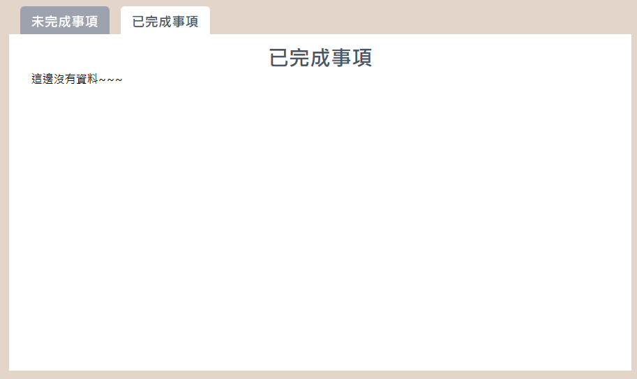
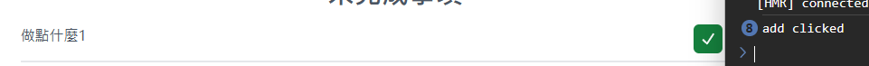

//把完成部分 todo 的勾勾拔掉
先來看一下昨天的進度，我們已經可以把 user 輸入的資料加到下方的 todo 之中，但是會發現，當我們送出資料後輸入欄位的資料還是存在欄位中，所以我們回頭去修改一下 function。

```
  const handleGetSubmitResult = (result) => {
    // console.log("from TodoInput:", result);
    setTodoList(() => {
      const getLastItem = todoList[todoList.length - 1];
      const newTodo = [
        ...todoList,
        { ...getLastItem, id: getLastItem.id + 1, title: result, desc: "" },
      ];

      return newTodo;
    });
  };
```

這邊是我們用來處理 onchange 事件的 function，可以看到我們只是通過獲得子元件傳來的資料進行處理而已，雖然我們是在父層處理資料的，但是輸入欄的狀態所有權還是在他自己，所以我們需要回到子元件中修改 function 的數據。

```
  const handleSubmit = () => {
    const result = inputValue;
    handleOnSubmit(result);
    setInputValue(""); //加上這行 將輸入欄的資料在送出後重置成空的
  };
```

接下來我們繼續看一下目前的專案還有甚麼問題，我們來條列式的檢視一下現在我們的 Todo 有哪些功能。

- user 可以透過輸入欄位新增資料
- user 可以透過刪除按鍵移除資料

OK 現在我們知道還少了，在點擊未完成事項的時候，要將資料傳遞給以完成事項的 array。

```
    <HomeListPage
    title="未完成事項"
    todoList={todoList}
    isMove={isFocus.tag2}
    renderAdd={renderCheck}
    renderDelete={renderCross}
    />
    <HomeListPage
    title="已完成事項"
    todoList={todoList}
    isMove={isFocus.tag2}
    // renderAdd={renderCheck}
    renderDelete={renderCross}
    />
```

可以看到目前我們兩個區塊都是使用同一個來源，所以我們先新增一個新的 useState 來儲存已完成事項

```
const [doneTodo,setDoneTodo] = useState([])
todoList={doneTodo}
```

這時候我們可以看到已完成事項的資料是空的

但是現在有一個問題，我們的按鈕是在元件中使用的，所以我們要先把他的 Click 事件往外並且把目標在array中的位置帶出來。

```
const HomeListPage = ({
...props,
  handleAdd
})

handleClick={(e) => {
    sendItemID(e, index);
}}
```

現在我們就可以繼續接下來的步驟，先建立用來處理事件的 function

```
  const sendItemId = (e, item) => {
    handleAdd(e, item);
  };
```

然後我們先試看看是不是有成功

接下來就可以繼續後面的流程，現在我們有目標的位置，我們找出目標位於todoList中的哪邊。
```
const handleAddClick = (ItemId) => {
const newTodoArr = todoList.map((e) => e);
const doneItem = newTodoArr.splice(ItemId, 1);
setTodoList(newTodoArr);

const newDoneArr = doneTodo.map((e) => e);
newDoneArr.push(doneItem[0]);
setDoneTodo(newDoneArr);
};
```
直接來看一下function，這個function做了2件事情，上半部分複製一個新的array並使用splice將目標位置的資料抽出來，最後更新Todo。
下半部分使用剛剛獲得的資料加入到複製出來的doneTodo中，並更新資料。
這樣新增功能就做好啦

