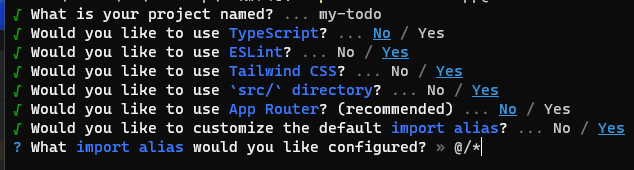
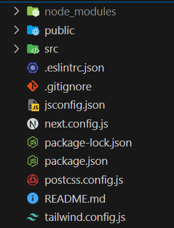

前面我們有提到這次要製作一個TodoList，首先我們先從這份project的功能來說。
一份完整的TodoList應該包含基本的CRUD

C：應該要可以建立一筆新的todo
R：應該要可以查看todo的內容
U：應該要可以更新todo的內容
D：應該要可以刪除已完成的todo

到目前為止我們可以知道基本的功能會有這些，接下來就可以開始建立我們的環境。

## Next.js
Next.js是一個React的框架，它可以幫助我們快速地建立一個專案，其中有內建router可以讓我們專注於project的部分。

## 安裝Next.js
```
npx create-next-app@latest
```

這邊簡單帶過就好，首先我們選擇JS並且使用ESLint配上TailWind CSS，並且我們需要使用src資料夾，app Router是Next最新版本的router，這邊先不使用。
最後一項就是選擇root目錄的別名。
- 原本我們需要找資料可能需要使用到
```
../../
```
* 當資料夾很深的時候，import那邊會很亂，所以使用```@/*```從root開始往下找。


使用cd進入到剛建立好的資料夾
```
cd my-todo
```

接下來我們可以看到這樣的目錄


接下來就可以開始我們的專案了！
