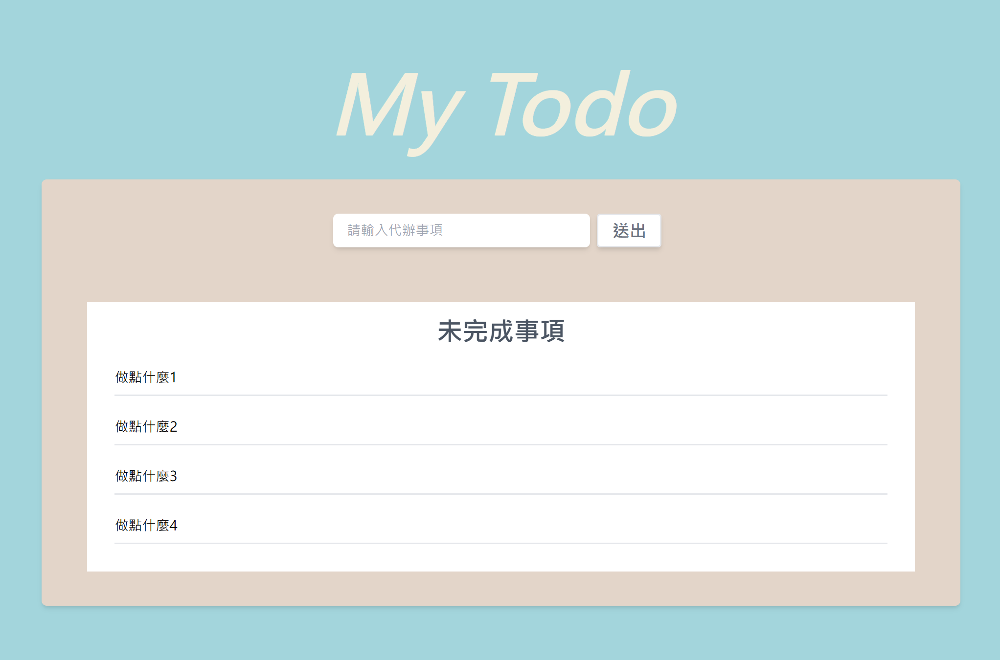
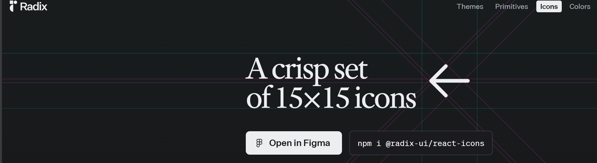
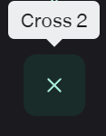
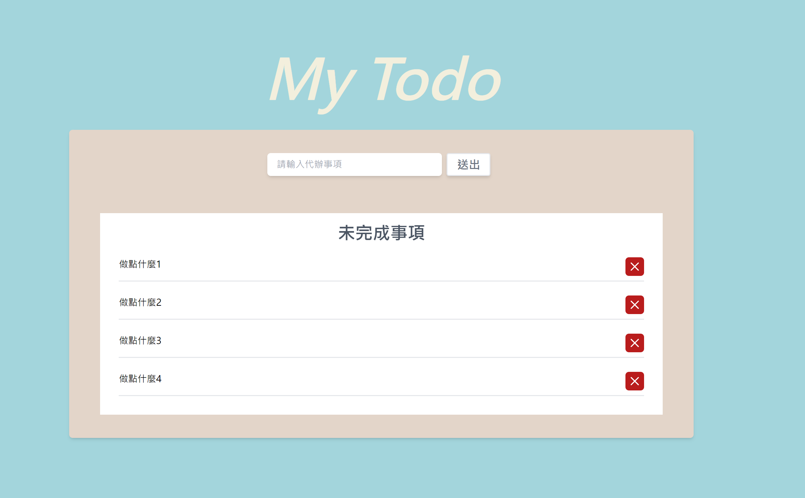

一般聽到 Todo List，我們都會很直覺的認為他應該要有一個輸入框後方會有一個按鈕讓我們新增在輸出框打的文字，下方會有一個區塊顯示代辦清單、已完成清單。

既然已經知道該有這些畫面，我們就可以開始進行 UI 的製作。
首先我們先將一整個區塊製作出來。

首先我們先建立一個輸入區塊的的 component，其中包含一個輸入框&按鈕。
//homePage.jsx -TodoInput

```
const TodoInput = () => {
  return (
    <div className="flex self-center">
      <input
        type="text"
        className="w-[300px] rounded-md pl-4 shadow-md"
        placeholder="請輸入代辦事項"
      />
      <div className="rounded mx-2 border-2 px-4 py-1 cursor-pointer shadow-md transition-all bg-white hover:bg-[#e3e8eB] text-gray-500 text-xl font-bold">
        送出
      </div>
    </div>
  );
};
```

接下來開始製作一整個顯示未完成事項的區塊。

```
function home() {
  return (
    <main>
      <Layout>
        <div className="w-1/2 min-h-[300px] bg-[#E3D5C9] rounded-md flex flex-col shadow-md py-10 gap-16">
          <TodoInput />
          <div className="flex overflow-hidden justify-start w-[90%] mx-auto">
            <div className="min-w-full bg-white flex flex-col items-center py-4 px-8">
              <h3 className="text-3xl text-gray-600 font-bold">未完成事項</h3>
              <ul className="self-start w-full">
                <li className="my-4 py-2 border-b-2">做點什麼1</li>
                <li className="my-4 py-2 border-b-2">做點什麼2</li>
                <li className="my-4 py-2 border-b-2">做點什麼3</li>
                <li className="my-4 py-2 border-b-2">做點什麼4</li>
              </ul>
            </div>
            <div className="min-w-full bg-white h-[300px]"></div>
          </div>
        </div>D
      </Layout>
    </main>
  );
}

export default home;
```


現在我們就有基本的 UI 畫面了。
可以看到中間的區塊內有剛剛提到的，一個給 user 輸入事項的輸入框，後面接著一顆送出的按鈕。
下方會有一個區塊顯示未完成事項。

到目前這邊看起來好像沒甚麼問題，但是我們還少了一個刪除的按鈕。
所以我們可以在每個事項的後方區塊加上一個刪除按鈕。

這時候我們就可以使用一個名叫 Radix icon 的工具。
他提供許多現成的 icon 讓我們可以直接使用。
首先來到官網，我們可以看到這邊請我們先使用 npm 進行安裝。


```
npm i @radix-ui/react-icons
```

在執行完上面那段 code 之後我們往下找到我們需要的 icon。


然後在 react 中進行 import。

```
import { Cross2Icon } from "@radix-ui/react-icons";
```

這樣我們就可以把它當作一個 component 放到我們的 home 區塊裡面。

```
<button className="bg-red-700 rounded-md w-8 h-8 flex justify-center items-center text-white">
<Cross2Icon className="w-6 h-6" />
</button>
```

現在我們的畫面就會變成這樣。
