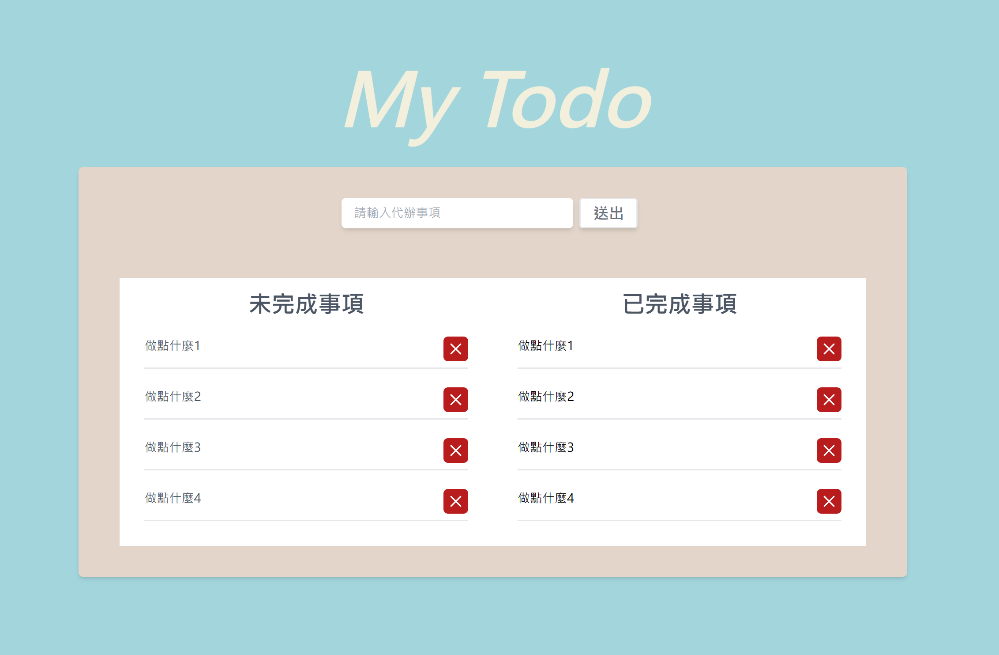
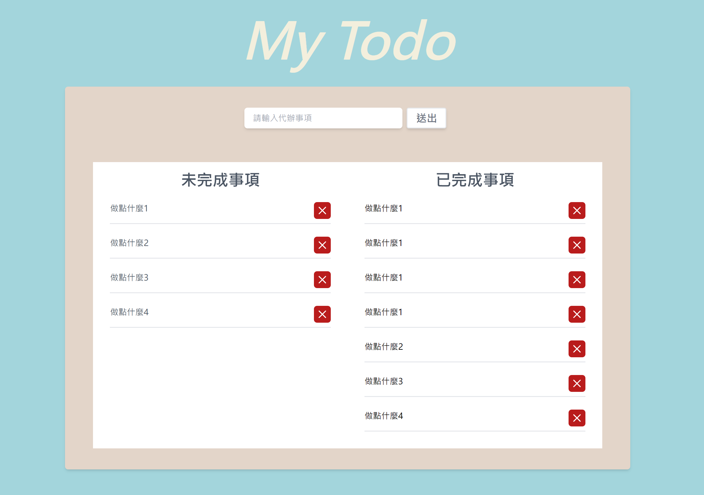
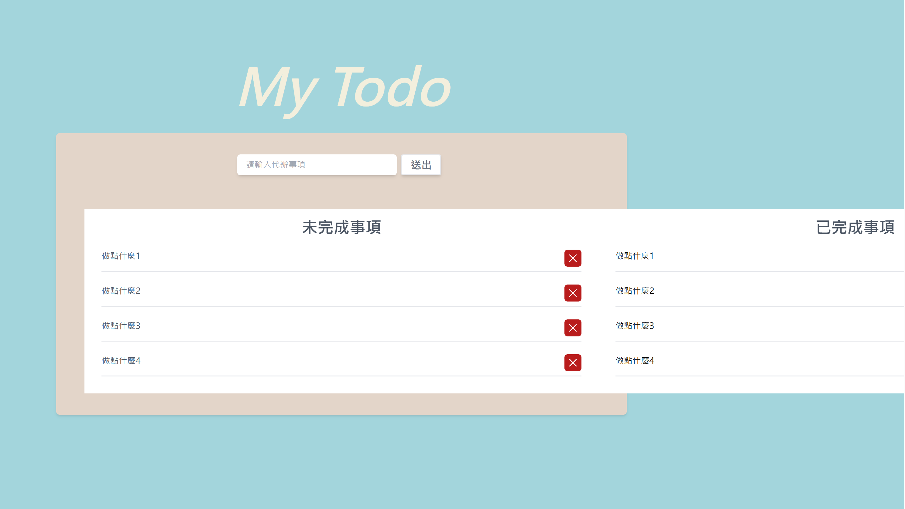
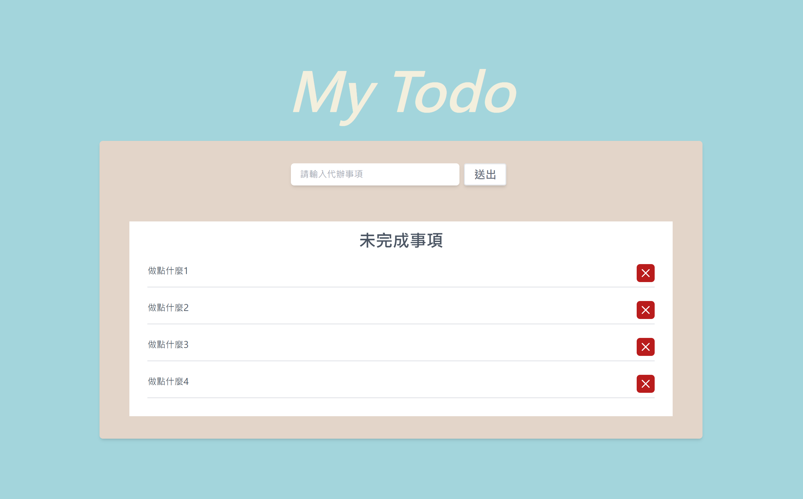
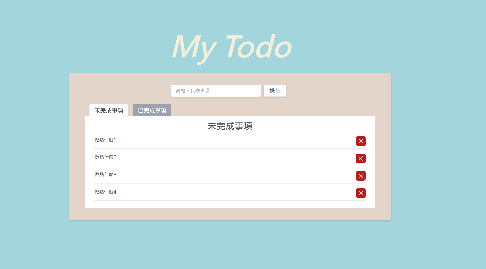
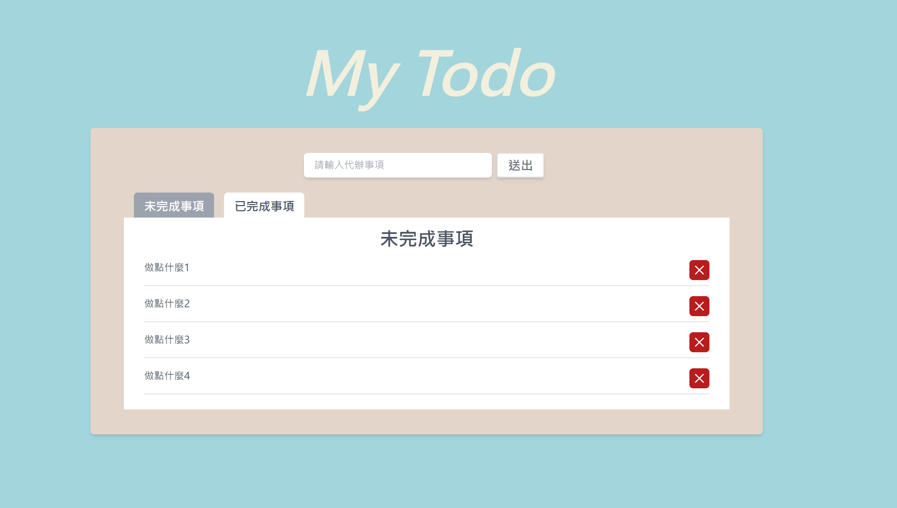

這個是我們現在的畫面，首先我們先看一下有那些問題。

1. 有未完成事項卻沒有完成事項。
2. 輸入區塊好像有點太小了。
3. 少了一個完成的按鈕。

我們先來處理第一項，現在我們可以直接在區塊內加上一個已完成事項的區塊。

只要左右各佔一半就好了，那這樣我們的問題是不是解決了?

如果只是要加上一個區塊的話，我們確實是已經完成這個問題了。
但是身為一名工程師，我們應該想一下是不是可以讓畫面更加協調。
現在我們可以看到左右對稱，好像沒有甚麼問題，那如果現在我們的畫面上左右的數量不是相等的呢?
是不是就會發生其中一邊會有一大塊空白的問題。
就像這樣

這樣是不是瞬間畫面就不協調了，那我們可以如何解決這個問題呢

首先，我們將 2 個區塊的寬度都吃滿他們的父層，並且讓他們左右並排。

接下來使用`overflow-hidden`超出的部分隱藏起來。

那我們要如何切換畫面呢?
這時候我們可以使用頁籤的方式，進行頁面的切換。

現在我們可以看到上方有兩個頁籤，當前標籤的樣式會不太一樣。

接下來我們會使用`useState`對針對頁籤狀態進行 style 變化。

```
const [isFocus, setIsFocus] = useState({ tag1: false, tag2: false });
```

然後在點擊頁籤的時候觸發點擊事件
//未完成事項

```
onClick={() => {
    setIsFocus((prev) => ({
    ...prev,
    tag1: !prev.tag1,
    }));
}}
```

現在看起來好像沒有問題

當我點擊頁籤的時候，頁籤可以順利的變色，但現在還有個問題，就是兩個頁籤會同時變色。
所以我們可以把 onClick 事件改一下。

```
onClick={() => {
    setIsFocus((prev) => ({
    ...prev,
    tag1: false,
    tag2: !prev.tag2,
    }));
}}
```

現在我們發現這兩個頁籤的 function 有 87%相似。
所以我們可以把這段邏輯抽出來包在一個新的function中，以傳入的value進行更新。

```
  const togglePage = (tag) => {
    setIsFocus((prev) => {
      //先儲存整個state
      const updateState = { ...prev };

      //reset所有標籤
      for (const key in updateState) {
        if (key !== tag) {
          updateState[key] = false;
        }
      }

      //更新點選頁籤的狀態
      updateState[tag] = !prev[tag];

      return updateState;
    });
  };
```
