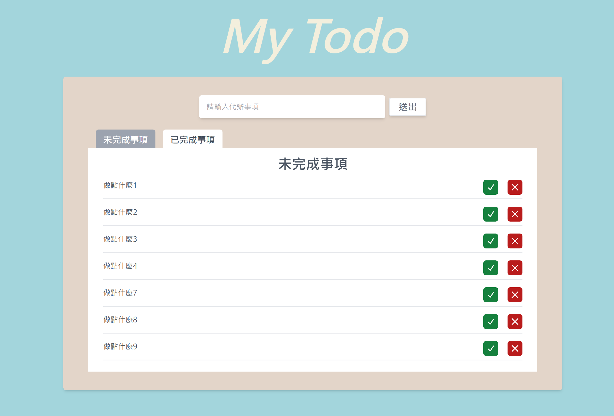
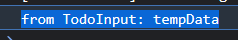

//修改 btn component

今天我們繼續把畫面修一下，之前有提到少了一個已完成的按鈕。
先來看一下我們的`HomeListPage`，我們之前已經把 icon 的部分以 render props 的方式拆了出來，讓抽換 ICON 更加靈活。
但是現在有個新的問題，若是我想在 container 那層進行操作的話，目前看起來是不可行的，所以我們可以把 TodoBtn 的區塊挖空，作為`{children}`拋到父層。‵`

```
<li
    className="my-2 py-2 border-b-2 flex justify-between"
    data-todo={"todo" + index}
    key={"todo" + index}
>
    <span className="text-gray-600">{todo}</span>
    <TodoBtn
    renderChildren={buttonIcon()}
    handleClick={(e) => handleDeleteBtnClick(e, index)}
    />
</li>
```

變成

```
    <li
        className="my-2 py-2 border-b-2 flex justify-between"
        data-todo={"todo" + index}
        key={"todo" + index}
    >
        <span className="text-gray-600">{todo}</span>
        {children}
    </li>
```

//父層

```
    <HomeListPage
    title="已完成事項"
    todoList={todoList}
    isMove={isFocus.tag2}
    >
    <TodoBtn
        renderChildren={() => <Cross2Icon className="w-6 h-6" />}
        handleClick={(e) => handleDeleteBtnClick(e, index)}
    />
    </HomeListPage>
```

這時候我們要新增一個 btn 就簡單許多了，只要把`TodoBtn`再拉一顆出來就可以了。

```
<TodoBtn
    renderChildren={() => <CheckIcon className="w-6 h-6" />}
    handleClick={(e) => handleDeleteBtnClick(e, index)}
/>
```

不過現在我們想要更改按鈕的顏色，但是 component 的 style 已經寫好了，我們可以回到按鈕的 component 中，把 class 抽出來，並且作為變數丟出來

```
const TodoBtn = ({ renderChildren, handleClick,className }) => {

  const defaultClass = `rounded-md w-8 h-8 flex justify-center items-center transition-transform hover:scale-[1.1] text-white `
  const newClass = defaultClass + className
  return (
    <button
      className={newClass}
      onClick={handleClick}
    >
      {renderChildren()}
    </button>
  );
};
```

現在我們可以在元件外部進行 class 的操作了

```
    <TodoBtn
        renderChildren={() => <CheckIcon className="w-6 h-6" />}
        handleClick={(e) => handleDeleteBtnClick(e, index)}
        className={"bg-green-700"}
    />
```

目前為止我們可以看到畫面變成這樣。


接下來我們就要把上面送出待辦事項按鈕的功能補上。回到上面可以看到我們還沒把`TodoInput`中的事件丟出來。

```
const TodoInput = () => {
  return (
    <div className="flex self-center justify-center w-full h-[50px] pl-4 pr-2">
      <input
        type="text"
        className="flex-1 max-w-[400px] rounded-md pl-4 shadow-md"
        placeholder="請輸入代辦事項"
      />
      <div className="self-center min-w-[80px] text-center rounded mx-2 border-2 px-4 py-1 cursor-pointer shadow-md transition-all bg-white hover:bg-[#e3e8eB] text-gray-500 text-xl font-bold">
        送出
      </div>
    </div>
  );
};
```

首先我們可以先把 click 事件加上去，並作為參數丟出去。

```
onClick={handleOnSubmit}
```

接下來我們需要在點下 button 的時候，取得 input 的事件，所以這邊加入一個 useState 存放輸入的 value。

```
  const [inputValue,setInputValue] = useState('')
```

接下來我們可以將`handleSubmit`做為參數丟出去，並且在父層使用 callback 的方式獲得`TodoInput`中的 data。

```
const TodoInput = ({ handleOnSubmit }) =>{...}
onClick={handleSubmit}
```

這邊使用`handleSubmit`處理 click 事件，並透過`handleOnSubmit`將 data 丟出去

```
  const handleSubmit = () => {
    const result = inputValue;
    handleOnSubmit(result);
  };
```

接下來我們可以在父層使用`handleGetSubmitResult`接收這個資料。

```
  const handleGetSubmitResult = (result) => {
    console.log("from TodoInput:", result);
  }
```


- 從子層往父層傳遞資料 > 使用call by function